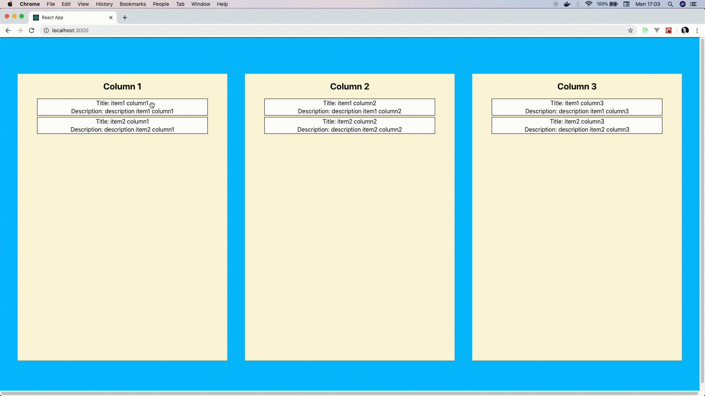

# React-Redux beautiful-dnd with styled-components
This is a project template to quickly get started with developing an app that features columns and items being drag & dropped
between them.

#### Project structure
The project structure is fairly simple.
The main component is called `Dashboard` and specifies the columns that should appear.
The function `onDragEnd` gets called by react-beautiful-dnd when someone finishes a drag & drop event. 
In there functions get called to recalculate the new state. As you can see in `itemReducer.js` the state has the following shape
```
const initialState = {
  items: {
    Column1: [
      {
        "id": "166b55f8-84eb-4a9f-9930-855dda68d016",
        "index": 0,
        "title": "item1 column1",
        "description": "description item1 column1 ",
        "status": "Column1",
      },
      {
        "id": "266b55f8-84eb-4a9f-9930-855dda68d016",
        "index": 1,
        "title": "item2 column1",
        "description": "description item2 column1",
        "status": "Column1",
      }
    ],
    Column2: [
      {
        "id": "366b55f8-84eb-4a9f-9930-855dda68d016",
        "index": 0,
        "title": "item1 column2",
        "description": "description item1 column2",
        "status": "Column2",
      },
      {
        "id": "466b55f8-84eb-4a9f-9930-855dda68d016",
        "index": 1,
        "title": "item2 column2",
        "description": "description item2 column2",
        "status": "Column2",
      }
    ],
    Column3: [
      {
        "id": "566b55f8-84eb-4a9f-9930-855dda68d016",
        "index": 0,
        "title": "item1 column3",
        "description": "description item1 column3",
        "status": "Column3",
      },
      {
        "id": "666b55f8-84eb-4a9f-9930-855dda68d016",
        "index": 1,
        "title": "item2 column3",
        "description": "description item2 column3",
        "status": "Column3",
      }
    ]
  }
};
```
so if you want to add a new column you have to add it in `Dashboard` and you have to extend the state accordingly.
When the state has been recalculated the full state gets overwritten by dispatching the action `setItems` inside `onDragEnd`.
This might not be optimal and you might want to consider only inserting and updating the necessary information. 

####  Notes
This template was built on top of [react-beautiful-dnd](https://github.com/atlassian/react-beautiful-dnd).
